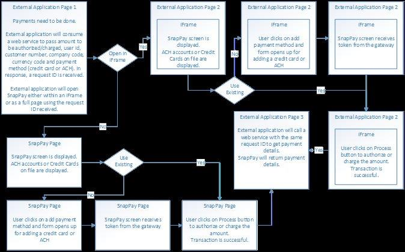

# APIs with User Interaction

## User Interaction APIs are used for the following use cases

1. Use SnapPay iFrame/Popup Form to authorize an amount using a saved or new credit card. The SnapPay iFrame will optionally display the following based on application configuration: ability to list, select, delete, edit or add a card.  
    To implement, use authorizationtype=”A” (Authorize) on API GetRequestID.
1. Use SnapPay iFrame/Popup Form to make a payment using saved or new payment method for a credit card or ACH account. The SnapPay iFrame will optionally display the following based on application configuration: ability to list, select, delete, edit or add a card as well as the ability to list, select, delete, edit or add an ACH bank account.  
    To implement, use authorizationtype=”S” (Sale) on API GetRequestID.
1. Use the SnapPay field level control iFrame to only tokenize a credit card number. The SnapPay iFrame will only display a single field for credit card number entry, and allows style sheet customization of the field display.  
    See section: API – GetRequestID – Field Level Control.

## API - Get Request ID – Full UI Option including iFrame

The GetRequestID API prepares SnapPay with the information required to properly display SnapPay from within an iFrame or as a full page for user interaction to Authorize, Charge or Tokenize a credit card or ACH account.  
  
Process Flow for interacting with users to authorize, charge or tokenize a credit card or ACH accounts.  

  
The external application will consume a web service GetRequestID to get a request ID by passing details like company code, currency code, etc. to SnapPay. SnapPay will store these details and responds with a request ID. The request ID will expire within a number of seconds after consuming the web service. The number of seconds until expiring is configured within the SnapPay account.  
After consuming the web service, the external application will either redirect the user to a page where the SnapPay screen will open in an iFrame or redirect the user to SnapPay page directly . User will be able to use ACH accounts or credit cards on file to authorize or charge the amount or add a payment method. Authorization is available for credit card only and not available for ACH. Based on the parameter (SavePaymentMethod), the user will be able to save the payment method for future use.  
After successful authorization or charge/sale transaction, SnapPay will redirect the user back to the external application page. The redirection URL is one of the parameters sent in the initial request. Before displaying the page, the external application will consume a web service to get payment details from SnapPay.

### Pseudo code illustration

1.  External application consumes the web service GetRequestID to get Request ID that will be used to open SnapPay in an iFrame. Transaction type defines the behavior of SnapPay. If transaction type is set to A, SnapPay will perform authorization transaction either using an existing credit card or new credit card. Only credit card is supported for A transaction type. If the transaction type is set to S, SnapPay will perform sale (charge or auth + capture) transaction. Both credit card and ACH are supported for S transaction type.
2.  After receiving the Request ID, the external application opens SnapPay in an iFrame or as a full page using the following URL. [www.stage.snappayglobal.com/Interop/InteropRequest?reqno=808be7ac-7ddf-ed11-bad3-0022488db98a](https://urldefense.com/v3/__http://www.stage.snappayglobal.com/Interop/InteropRequest?reqno=808be7ac-7ddf-ed11-bad3-0022488db98a)  
    User will submit authorization/sale transaction and SnapPay will redirect the user to the URL mentioned in the redirecturl parameter.  
    **Note1: Your application will be able to open SnapPay within an iFrame only if your application URL uses https with a proper domain name.**  
    **Note2: iOS does not support SnapPay within an iFrame. For requests coming from iOS, set the value of the paramter openiniframe to N.**
3.  External application consumes the web service GetPaymentDetails to get ACH/credit card token along with payment transaction details and displays confirmation page.

### In short, consume GetRequestID → open SnapPay → consume GetPaymentDetails
  
If the user requests to save a payment method, they will be associated with the userid that is passed. They will be displayed on later calls for the same userid. A SnapPay configuration parameter determines if the user is matched with a SnapPay user, allowing the same payment methods to be shared and updated by SnapPay EIPP and this API.
